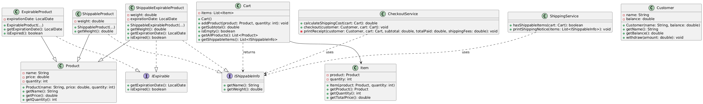

# Shippable & Expirable Product Checkout System

This is a Java-based object-oriented simulation of a shopping system that handles different types of products, including:

- Shippable products  
- Expirable products  
- Products that are both shippable & expirable  

The system supports cart management, shipping calculation, checkout processing, and receipt/shipping notices.

---

## Project Structure

``` 
src/
│
├── interfaces/
│ ├── IShippableInfo.java
│ └── IExpirable.java
│
├── Products/
│ ├── Product.java
│ ├── ShippableProduct.java
│ ├── ExpirableProduct.java
│ └── ShippableExpirableProduct.java
│
├── User/
│ ├── Customer.java
│
│── Cart/
│   ├── Cart.java
|   ├── Item.java
|
├── services/
│ ├── CheckoutService.java
│ └── ShippingService.java
│
└── Main.java
 ```
 
---

## Features

- Add different product types to the cart
- Auto-detect if a product is shippable or expirable using interfaces
- Checkout system with receipt generation
- Shipping cost calculation based on weight
- Shipping notice printing for physical products

---

## Example Scenario

```java
ShippableExpirableProduct food = new ShippableExpirableProduct("food", 2.2, 2, 2.5, LocalDate.now().plusDays(2));
ShippableProduct tv = new ShippableProduct("Smart TV", 300.0, 10, 10.5);
Product scratchCard = new Product("Scratch Card", 2.0, 100);

Customer customer = new Customer("Ahmed", 2000.0);

Cart cart = new Cart();
cart.addProduct(food, 2);
cart.addProduct(tv, 3);
cart.addProduct(scratchCard, 1);

CheckoutService checkoutService = new CheckoutService();
checkoutService.checkout(customer, cart);

ShippingService shippingService = new ShippingService();
if (shippingService.hasShippableItems(cart)) {
    shippingService.printShippingNotice(cart.getShippableItems());
}
```
## Key Concepts Used

- Object-Oriented Design (OOP)
- Interface segregation (`IShippableInfo`, `IExpirable`)
- Encapsulation and modular design
- Interface-based polymorphism with `instanceof`

---

## UML Diagram




---

## To Run

1. Clone or download this project.
2. Open it in your Java IDE.
3. Run `Main.java`.

---
